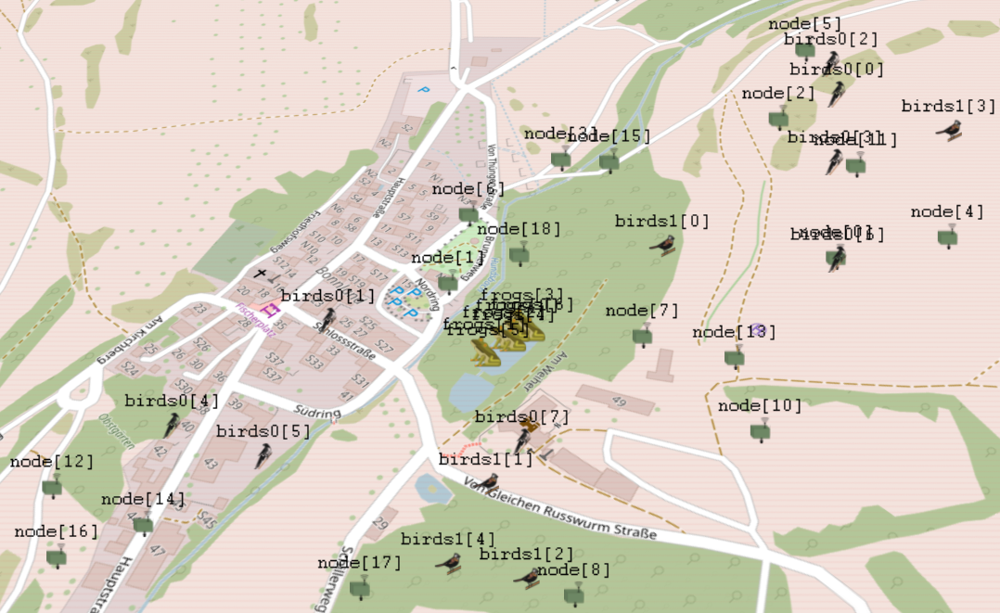

<h1 align="center">TAWNS &mdash; A Terrestrial Acoustic and Wireless Network Simulation Framework</h1>

<p align="center" width="100%">
 
</p>

![Version][version-badge]
![LGPL][license-badge]
![Supported OS][os-badge]

[license-badge]: https://badgen.net/badge/license/LGPL%20v3.0%20or%20later
[os-badge]: https://badgen.net/badge/OS/Ubuntu%2020.04+/green
[version-badge]: https://badgen.net/badge/version/1.0/blue


# Introduction

Wireless Sensor Networks that address audio-related applications have been researched for over a decade. But reproducibility and customizability are a challenge when focusing on research questions in outdoor environments (e.g., localization of wildlife species). It usually involved the design of customized prototypes and time-consuming and often error-prone deployments to generate a ground truth. Here, we propose TAWNS, an Open Source model framework for Omnet++/INET, which supports researchers conducting simulations on wireless acoustic sensor networks - either as the main focus of study or as a component. It inherits all the networking and wireless communication elements supported by the library INET and provides a novel, easy-to-use spatial audio simulator for 3-D sound environments. For the latter, we adapted and extended the library Scaper by adding a customized model for attenuating and delaying the acoustic signals. Our model parameters are derived from multiple measurements with different hardware. For further details, check our paper below.

Feel free to use TAWNS in your research. If you do, please cite as:

```
@inproceedings{brueggeman2022tawns,
  title={TAWNS - A Terrestrial Acoustic and Wireless Network Simulation Framework},
  author={Brueggemann, Leonhard and Schuetz, Bertram and Aschenbruck, Nils},
  booktitle = {EAI 15th International Conference on Performance Evaluation Methodologies and Tools},
  year={2022},
}
```

# License
TAWNS is composed of many parts. Each part is protected by its own individual copyright(s) but can be redistributed and/or modified under an open-source license. License terms are available at the top of each file (except for the modified version of the Scaper framework). For details about the license of the Scaper framework, check src/tawns/acoustic/ScaperSoundPropagation/scaper/scaper/LICENSE. Other parts that do not explicitly include license text shall be assumed to be governed by the "GNU Lesser General Public License" as published by the Free Software Foundation -- either version 3 of the License, or (at your option) any later version (SPDX-License-Identifier: LGPL-3.0-or-later). Parts not source code and do not include license text (such as provided audio files and images) follow different Creative Commons Licenses (see ./audioLibrary/LICENSE.md and ./images/LICENSE.md).


# Contents

[Setup](#Setup) 
[Prerequisites](##Prerequisites)    
[Installation](##Installation)  
[Getting started](##Getting started)    
[Further explanations](##Further explanations)    

## Setup (Ubuntu 20.04 or later)

## Prerequisites 

Install ffmpeg:
```
sudo apt-get install ffmpeg
```


Optional: If you want to use Omnet++'s graphical visualization, your platform needs a suitable Qt package. Alternatively, only the command-line interface is supported.

```
sudo apt-get install qt5-default
```

Optional: If you want to use TAWNS in conjunction with real maps and their visualization in Qtenv. Note that Ubuntu 22.04 no longer provides the libosgearth package, so osgEarth must be installed from source whose installation is sparsely documented for Linux.
```
sudo apt-get install openscenegraph-plugin-osgearth libosgearth-dev
```

## Omnet++' Installation

Download official Omnet++ v6.01 [release] (https://omnetpp.org/download/).

Change default Omnet++'s C++ version to C++17:
```
cd OMNETPP_DIR
sed -i 's/#CXXFLAGS=-std=c++17/CXXFLAGS=-std=c++17/g' configure.user
```

### Configuration Options
Omnet++' support multiple (build options)[https://doc.omnetpp.org/omnetpp/InstallGuide.pdf]. Here the three most prominent ones:

1. With Command-line interface, but no graphical visualization and no mapping-support.

```
source setenv
./configure
```

2. With command-line interface and graphical visualization, but no mapping-support.

```
source setenv
./configure WITH_QTENV=yes
```

3. With command-line, graphical visualization and mapping-support.

```
source setenv
./configure WITH_QTENV=yes WITH_OSG=yes WITH_OSGEARTH=yes
```

## INET' Installation

Install the INET framework v4.4.1 accoring to [official guide] (https://inet.omnetpp.org/Installation.html). It is not necessary to build the project yet.

## Get TAWNS' and install Scaper dependencies

config Omnet++

Clone TAWNS repository and install modified Scaper distribution:

```
cd SOME_DIR
git clone TODO-LINK_TAWNS
cd TAWNS_DIR
cd src/tawns/acoustic/ScaperSoundPropagation/scaper/scaper
pip3 install -e .
```

## Configure Omnet++

Run Omnet++ GUI:
```
omnetpp
```

If the error "omnetpp: command not found" occurs, then because the environment variables are unknown. Do the following to solve that:

```
cd OMNETPP_DIR
source setenv
omnetpp
```

Import INET and TAWNS.

```
File --> Import --> Import Projects from File System or Archiv --> TAWNS / INET directory
```
 
Link TAWNS with INET.

```
Project->Properties-> Project References -> include INET
```

# Getting started
TAWNS is an Omnet++ project. Thus, it inherits all its functions. That means, among others, that TAWNS uses (simple) modules that interact together to build complex simulations. 
In the following, we will guide you through an example so that you can build your configuration. We will explain some more implementation details, but will not cover all fundamentals of Omnet++, INET and Scaper. You can find the code in the directory examples/Showcase. It contains a 2D visualization of a 3D coordinate system and 3D visualization of a geocentric coordinate system.

## Make a Simulation
The first step when building a simulation is to create a directory such as examples/showcase and create a network description file (\*.ned) and an initialization file (\*.ini). Both files are required to run a simulation. The .ned-file introduces an identifier and describes its type. The .ned-file of a simulation always includes a network definition which can include parameters, statistics, submodules, channels, and more. A .ned-file might look like this:

```
network Showcase_2D
{
    parameters:
        int numDevs;
        int numBirds0;
        int numBirds1;

    submodules:
        node[numDevs]: ManetRouter {
            parameters:
                @display("r=,,#707070;p=150,200");
        }
        clusterhead: ManetRouter {
            parameters:
                @display("r=,,#707070;p=150,200");
        }
        configurator: Ipv4NetworkConfigurator {
            parameters:
                @display("p=212,15;is=s");
        }
        radioMedium: Ieee80211ScalarRadioMedium {
            parameters:
                @display("p=122,15;is=s");
        }
        internetCloud: InternetCloud {
            @display("p=650,425;is=vl");
        }
        backend: StandardHost {
            parameters:
                @display("p=850,425");
        }
        // ------------ Audio Modules ----------------------------------------- //
        ambient: Ambient {
            @display("p=386,15;is=s");
        }
        bird0[numBirds0]: SoundSource {
            @display("i=soundsource/bird1");
        }
        bird1[numBirds1]: SoundSource {
            @display("i=soundsource/bird2");
        }
        soundManager: SoundManager {
            @display("p=306,15;is=s");
        }
    connections:
        clusterhead.pppg++ <--> Eth10M <--> internetCloud.pppg++;
        internetCloud.pppg++ <--> Eth10M <--> backend.pppg++;
}
```
In the above configuration, there are modules for the wireless acoustic network that records and transmits audio and for the acoustic simulation.
A module's parameters can be configured, which is done in the configuration file in omnetpp.ini. But let us take a closer look at the declared modules first:
- In the above example, our recording devices are modules of ManetRouter, meaning that the nodes form an ad-hoc network. For alternatives, check src|inet|node|inet or src|tawns|node|inet.
- The configurator module sets the IP addresses and more, and by default, it will assign the addresses automatically. Check the INET [configuration tutorial] (https://inet.omnetpp.org/docs/tutorials/configurator/doc/index.html) for further details.
- The radioMedium defines which kind of radio model we want to use for data transmission (in this case, we use the Ieee80211ScalarRadioMedium). For details, check its [inet documentation] (https://inet.omnetpp.org/docs/users-guide/ch-transmission-medium.html).
- The ambient module sets some static acoustic interference, e.g., sounds created by wind or a street. Note that ambient sound is identical for all nodes.
- The soundSources are entities that can move through the area and will emit sounds from time to time.
- The soundManager handles the generation of the spatial soundscapes, and to do so, it collects all required information from all modules involved. That information is in the soundManager itself (e.g., speed of sound), the sound sources, the ambient sound,  and of course, nodes that are equipped with microphones (in more technical terms, nodes that inherit from tawns.node.base.ApplicationLayerNodeBase or one of its children).


While in the .ned file, the modules are declared, the initialization file omnetpp.ini can be used to configure the modules and the simulation. 
Note that the configuration of modules can also be done in the .ned-file, but usually, the .ini file is used.
The initialization file is structured by configurations that are marked by \[CONFIGNAME\]. 
The first config is in the first line called [General] and typically refers to identical parameters in all configurations. Other simulation configurations are set by using \[Config CONFIG\_NAME\] or \[CONFIG\_NAME\]. A .ini-file might look like this.

```
[General]
image-path = "path/to/tawns/images"
sim-time-limit=60s # simulation time must be set in tawns, it sets the duration of your generated audio data
num-rngs = 1 # use only one random number generator
seed-set = 13  # a seed for reproducibility

# misc network parameters
**.arp.typename = "GlobalArp"
*.backend.numPppInterfaces = 1
*.clusterhead.numPppInterfaces = 1
**.internetCloud.ipv4Delayer.config = xml(\
    "<internetCloud symmetric='true'> \
      <parameters> \
        <traffic src='**' dest='**' delay='uniform(20ms,25ms)' datarate='4000kbps' drop='false' /> \
      </parameters> \
    </internetCloud>")

# app configurations
**.node[0].numApps = 1
**.node[0].app[0].typename = "FtpTcpSimple"
**.node[0].app[0].connectAddress = "backend"
**.node[0].app[0].connectPort = 2000
**.node[0].app[0].tOpen = 2s
**.node[0].app[0].tSend = 2.5s

**.backend.numApps = 1
**.backend.app[0].typename = "FtpTcpSink"
**.backend.app[0].localPort = 2000
```
Here are some explanations of the parameters:
- To use the images provided by TAWNS, set the image-path to the absolute path of your TAWNS project. We hope to provide an automatic version in the future. 
- The sim-time-limit has to be set in TAWNS as it defines the duration of wireless network simulation and spatial sound simulation.
- For better reproducible reasons, we will use one random number generator and a seed. Not that this seed is only applied in the wireless network simulation. For the sound simulation, a different seed is used in tawns.acoustic.soundManager.
- Some used modules require various configurations to work, but it can be simplified (e.g., we assume global address resolution without exchanging packets), so we define to use GlobalArp, add an interface to our backend and clusterhead and configure our internetCloud.
- Our nodes should transfer their data via a clusterhead and some internetcloud to a backend. To do so with real data, we specify the apps to use a custom TCP-based application.

The above configuration is identical for the configuration \[Config Vis2D\] and \[Config Vis3D\]. Let us take a closer look at Vis2D first: 
```
[Config Vis2D]
description = "Multiple devices record the sounds in their area and transmit the data by a clusterhead to a destination. "
network = Showcase_2D # note that this is identical to the network in the .ned-file

# constrain simulated area
**.constraintAreaMinX = 0m
**.constraintAreaMinY = 0m
**.constraintAreaMinZ = 0m
**.constraintAreaMaxX = 1000m
**.constraintAreaMaxY = 700m
**.constraintAreaMaxZ = 40m

# configuration of recording nodes
*.numDevs = 10
**.node[*].mobility.typename = AStationaryMobility # ALL nodes  use the AStationaryModel
**.node[*].mobility.initialX = uniform(175m, 450m) 
**.node[*].mobility.initialY = uniform(175m, 450m) 
**.node[*].mobility.initialZ = 1m
**.clusterhead.mobility.typename = AStationaryMobility
**.clusterhead.mobility.initialX = 450m
**.clusterhead.mobility.initialY = 425m
**.clusterhead.mobility.initialZ = 1m

# configuration of sound source
*.numBirds0 = 3
**.bird0[*].mobility.typename = AStationaryMobility  # ALL sources  use the AStationaryModel
**.bird0[*].mobility.initialX = uniform(150m, 450m) 
**.bird0[*].mobility.initialY = uniform(150m, 450m) 
**.bird0[*].mobility.initialZ = uniform(1m, 30m)
**.bird0[*].id = "Parus major"
**.bird0[*].audio.absPath = "../.././audioLibrary/foreground/birds/Parus_major/XC694890-01.wav"
**.bird0[*].audio.maxSamples = 2
*.numBirds1 = 3
**.bird1[*].mobility.typename = AStationaryMobility  # ALL sources  use the AStationaryModel
**.bird1[*].mobility.initialX = uniform(150m, 450m) 
**.bird1[*].mobility.initialY = uniform(150m, 450m) 
**.bird1[*].mobility.initialZ = uniform(1m, 30m)
**.bird1[*].id = "Turdus merula"
**.bird1[*].audio.absPath = "../.././audioLibrary/foreground/birds/Turdus_merula/XC764740-01.wav"
**.bird1[*].audio.maxSamples = 2

# configuration of ambient
**.ambient.audio.absPath = "../.././audioLibrary/background/environmental/pasture/silentNight.wav"  # assign path where audio exists
```

In the above configuration, we do the following:

- We limit our simulated area. We do this primarily for visualization reasons here. However, if the position of our nodes is not set manually (which we do here), they are automatically placed based on the constrained area.
- We configure our simulation to have 11 devices (10 nodes, 1 clusterhead) and place them in our area. By default, each node has one microphone. See examples/SpatialSoundSimulation for using multiple microphones.
- We place our soundsources always in the same manner: set their position, set their identifier, set the path to the audio used and set the max number of samples. Note that the sound simulation requires the audio path to start with audioLibrary/foreground/ followed by two directories. The maxSamples are used to limit the number of occurrences of an emitted sound. The times when a song occurs are (more or less) randomly calculated in the implemented scaper extension.
- The requirements of the audio path in the ambient module are identical to the soundsources.

## 3D Visualization
TAWNS also supports 3D visualization of the OpenSceneGraph and its geocentric coordinate system. The following network definition in the .ned-file now looks slightly different. There are two new modules, the IntegratedVisualizer and the OsgGeographicCoordinateSystem. Both are necessary for the visualization and the conversion between geocentric and local coordinates. Note that we dropped the internetCloud and the backend for visualization reasons as they have no geographic relation.

```
network Showcase_3D
{
    parameters:
        int numDevs;
        int numBirds0;
        int numBirds1;
        int numFrogs;
    submodules:
        // ------------ 3D Mapping ----------------------------------------- //
        visualizer: IntegratedVisualizer {
            parameters:
                @display("p=100,50");
        }
        coordinateSystem: OsgGeographicCoordinateSystem {
            parameters:
                @display("p=100,150");
        }
	// ------------ Wireless Network Modules ----------------------------------------- //
        node[numDevs]: ManetRouter {
            parameters:
                @display("r=,,#707070;p=150,200");
        }
        configurator: Ipv4NetworkConfigurator {
            parameters:
                @display("p=212,15;is=s");
        }
        radioMedium: Ieee80211ScalarRadioMedium {
            parameters:
                @display("p=122,15;is=s");
        }
	// ------------ Audio Modules ----------------------------------------- //
        ambient: Ambient {
            @display("p=386,15;is=s");
        }
        birds0[numBirds0]: SoundSource {
            @display("p=56,102");
        }
        birds1[numBirds1]: SoundSource {
            @display("p=56,102");
        }
        frogs[numFrogs]: SoundSource {
            @display("p=56,102");
        }
        soundManager: SoundManager {
            @display("p=306,15;is=s");
        }
}
```

Its corresponding configuration in the .ini-file looks like this.

```
[Config Vis3D]
network = Showcase_3D

# Visualizer settings
*.visualizer.osgVisualizer.typename = "IntegratedOsgVisualizer"
*.visualizer.osgVisualizer.sceneVisualizer.typename = "SceneOsgEarthVisualizer"
*.visualizer.osgVisualizer.sceneVisualizer.mapFile = "bonnland.earth"

# Coordinates of the scene origin on the map
*.coordinateSystem.sceneLongitude = 9.8646046deg
*.coordinateSystem.sceneLatitude = 50.0495133deg

# set mobility model for nodes
*.numDevs = 5
*.node[*].mobility.typename = AStationaryMobility
*.node[*].mobility.coordinateSystemModule = "coordinateSystem"
*.node[*].mobility.initialAltitude = 1.0m
*.node[*].mobility.initFromDisplayString = false
*.node[*].mobility.initialLatitude = uniform(50.04712234deg, 50.05389188deg) 
*.node[*].mobility.initialLongitude = uniform(9.86543298deg, 9.86943298deg) 

# configuration of Soundsource 
*.numBirds0 = 10
*.birds0[*].display-string="i=soundsource/bird1"
*.birds0[*].mobility.typename = AStationaryMobility
*.birds0[*].mobility.coordinateSystemModule = "coordinateSystem"
*.birds0[*].mobility.initialAltitude = intuniform(2.0m, 20.0m)
*.birds0[*].mobility.initFromDisplayString = false
*.birds0[*].mobility.initialLatitude = uniform(50.04712234deg, 50.05389188deg) 
*.birds0[*].mobility.initialLongitude = uniform(9.86543298deg, 9.86943298deg)
*.bird0[*].id = "Parus major"
**.bird0[*].audio.absPath = "../.././audioLibrary/foreground/birds/Parus_major/XC694890-01.wav"
*.birds0[*].audio.maxSamples = 2  
*.numBirds1 = 8
*.birds1[*].display-string="i=soundsource/bird2"
*.birds1[*].mobility.typename = AStationaryMobility
*.birds1[*].mobility.coordinateSystemModule = "coordinateSystem"
*.birds1[*].mobility.initialAltitude = intuniform(2.0m, 20.0m)
*.birds1[*].mobility.initFromDisplayString = false
*.birds1[*].mobility.initialLatitude = uniform(50.04712234deg, 50.05389188deg) 
*.birds1[*].mobility.initialLongitude = uniform(9.86543298deg, 9.86943298deg)
*.bird1[*].id = "Turdus merula"
*.birds1[*].audio.absPath = "../.././audioLibrary/foreground/birds/Turdus_merula/XC764740-01.wav"
*.birds1[*].audio.maxSamples = 4
*.numBirds1 = 8
*.birds1[*].display-string="i=soundsource/bird2"
*.birds1[*].mobility.typename = AStationaryMobility
*.birds1[*].mobility.coordinateSystemModule = "coordinateSystem"
*.birds1[*].mobility.initialAltitude = intuniform(2.0m, 20.0m)
*.birds1[*].mobility.initFromDisplayString = false
*.birds1[*].mobility.initialLatitude = uniform(50.04712234deg, 50.05389188deg) 
*.birds1[*].mobility.initialLongitude = uniform(9.86543298deg, 9.86943298deg)
*.bird1[*].id = "Erithacus rubecula"
*.birds1[*].audio.absPath = "../.././audioLibrary/foreground/birds/Erithacus_rubecula/XC714199-01.wav"
*.birds1[*].audio.maxSamples = 4 
*.numFrogs = 7
*.frogs[*].display-string="i=soundsource/frog1"
*.frogs[*].mobility.typename = AStationaryMobility
*.frogs[*].mobility.coordinateSystemModule = "coordinateSystem"
*.frogs[*].mobility.initialAltitude = 0.1m
*.frogs[*].mobility.initFromDisplayString = false
*.frogs[*].mobility.initialLatitude = uniform(50.04987466deg, 50.05028973deg) 
*.frogs[*].mobility.initialLongitude = uniform(9.86689746deg, 9.86709327deg)
*.frogs[*].audio.label = "Hyla arborea" # used in the annotation file (ground truth)for the configuration 
*.frogs[*].audio.absPath = "../../audioLibrary/foreground/bird/kohlmeise_gesang.wav" # assign path where audio exists TODO: Hyla arborea
*.frogs[*].audio.maxSamples = 4 

# configuration of ambient sounds
**.ambient.audio.absPath = "../.././audioLibrary/background/environmental/pasture/silentNight.wav"

# add global noise to the generated soundscape (use NoneNoiseAndInterferenceModel for no additional noise in background audio)
**.soundManager.globalNoise.typename = "AWGNNoiseAndInterferenceModel"
**.soundManager.globalNoise.volume = -70.0
```

There are some things different compared to the previous visualization:
- If a 3D visualization should be used, a specific type of visualizer has to be used and configured. Note that it refers to a bonnlan.earth which is an xml-file that contains the configuration of osgEarth. The scenes longitude and latutude has also to be set.
- Note that the configuration of the nodes and the sources is now in degrees and now uses a different coordinate system module.
- The noise parameter of the module Soundmanager is also set. By using this parameter white noise can be added. The volume is set in db in relation to the maximum possible amplitude.


# Further explanations

## How the combined simulation works
When a simulation is fully configured and run, it is performed in two steps. First, the acoustic data is generated and saved in the directory results|soundscapes|\[NODE\]. Those directories contain all data that a node might record during a simulation, but depending on its recording schedule, it only uses parts of it. In the second step, the wireless network simulation is performed. Note that wireless network events cannot affect the sound source and vice versa. A minimal configuration suffices if you are interested only in the spatial generated data.

## Spatial Sound Simulation based on the Scaper Framework
By design, Scaper is used for soundscape synthesis and sound augmentation. A new set of audios (or, more precisely, soundscapes) can be generated by providing a set of recorded audios. Scaper distinguishes between an arbitrary number of foreground events (pre-existing audios) and background audio. However, Scaper has no concept of generating a soundscape that considers sound propagation in a virtual environment. Among others, this feature is added in TAWNS as follows:

### Delay
When adding foreground events, the parameter event_time is used to set the event's start time in a synthesized soundscape, and it can be adapted to consider propagation delays. We assume a simple model: delay [s] = |S(x,y,z)[m] - D(x,y,z) [m]| / Speed\_of\_Sound [mps] with S referring to the source coordination and D referring to the destination coordinates. 

### Attenuation
The sound attenuation was more complex and evolved around the Scaper parameters, ref\_db, and the foreground event's signal-to-noise (snr). 
When using Scaper without our modifications, the audios average amplitude is set to the target amplitude (called ref\_db in Scaper). Then the foreground events are added according to a specific snr value. 
The snr value says how much louder than the ref\_db the foreground event should be. The ref_db and snr are measured in LUFS.
 
Traditional sound propagation models do not fit to Scaper's concept of attenuating sounds according to the above parameters.
So we designed a model and fitted that based on our measurements. Our model's idea is the following: When we record audio, we basically convert the sound pressure and its changes at the microphone to an electronic signal that might be amplified and eventually digitized and saved in an audio file. So we have an indirect relation to the sound pressure that, by theory, propagates according to the inverse square law. Thus, we assume a logarithmic model and fit that model to actual measured data. Furthermore, the Scaper's snr parameter refers to the ref_db, so the ref\_db has to be considered, which eventually results in the following formula: snr = ref\_db - a  * log(max(1, x+b)) + c, where x is the distance between source and destination and a,b,c are fitted values (see TAWNS for details). The snr value is added to the audio that is set to the average target amplitude ref\_db. Note that our modification uses dBRMS per default instead of LUFS.

In TAWNS, the parameters that are used in sound processing are distributed in different classes. General sound parameters such as the ref\_db are set in the module SoundManager. In contrast, entity-specific parameters such as the coordinates or audios are configured in modules such as Ambient (refers to the background audio) or the module Soundsource (wraps the information regarding the foreground event).

## Using own audios in the Sound Simulation
The spatial sound simulation requires pre-recorded audios that exist in the directory tawns/audioLibrary. Note the structure of the provided audio. In the background, a directory is a set of subdirectories that contain the audio. The structure is the same for the foreground audio. If new audio should be used, place them in the subdirectories or make new ones that are referred to in the simulation. Referring to audios at other locations will result in errors due to dependencies in Scaper and the TAWNS.


